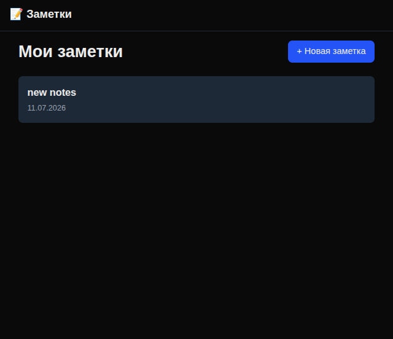
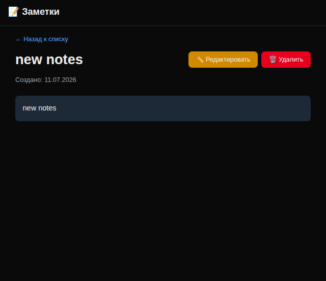

# Notes App (Приложение для заметок)

🔗 Живое демо: https://notes-app-alexbeard.vercel.app/

## Главная страница

## Заметка

Современное полнофункциональное CRUD-приложение для управления заметками, разработанное на базе Next.js (App Router). Проект демонстрирует лучшие практики серверных мутаций данных, коммерческий подход к обработке ошибок и оптимизацию пользовательского опыта.

## 🚀 Ключевой функционал и архитектура

* **Полный CRUD-цикл:** Бесшовное создание, просмотр списка, редактирование (с предзаполнением форм) и безопасное удаление заметок.
* **Next.js Server Actions:** Безопасная мутация данных напрямую на сервере без необходимости написания традиционных API-эндпоинтов.
* **Плавный UX для асинхронных операций:** Использование хука `useTransition` для мгновенной индикации состояний загрузки во время удаления и сохранения заметок.
* **Отказоустойчивость интерфейса:**
  * Нативная интеграция `loading.tsx` со скелетонами для плавной навигации между страницами.
  * Изоляция и обработка непредвиденных сбоев через `error.tsx` с кнопкой сброса (reset).
  * Кастомная страница `not-found.tsx` для понятной обработки 404-ошибок.
* **SEO и метаданные:** Динамическая генерация метатегов и уникальных заголовков для каждой страницы приложения.

## 🛠️ Стек технологий

* **Фреймворк:** Next.js (App Router)
* **Язык:** TypeScript / JavaScript
* **Управление данными:** React Server Actions, `useTransition`
* **Стилизация:**  Tailwind CSS 
* **База данных/Хранилище:** PostgreSQL

## Запуск
git clone ...

npm install

npx prisma migrate dev

npm run dev
